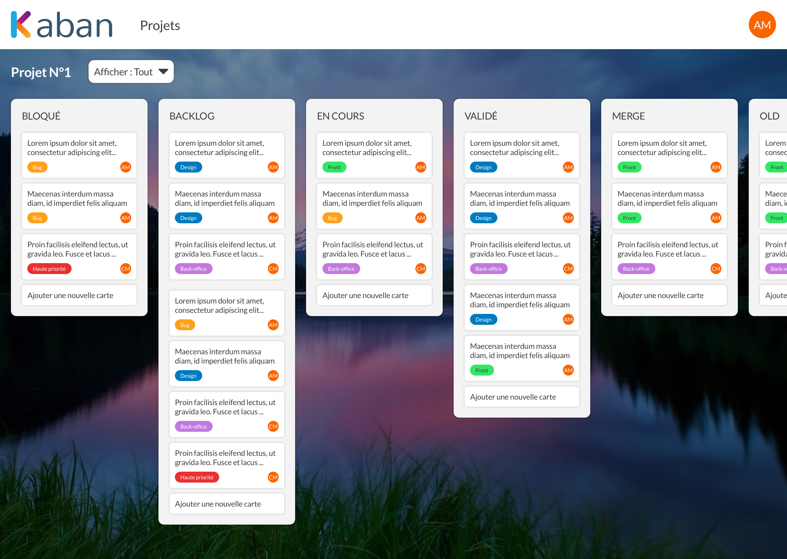
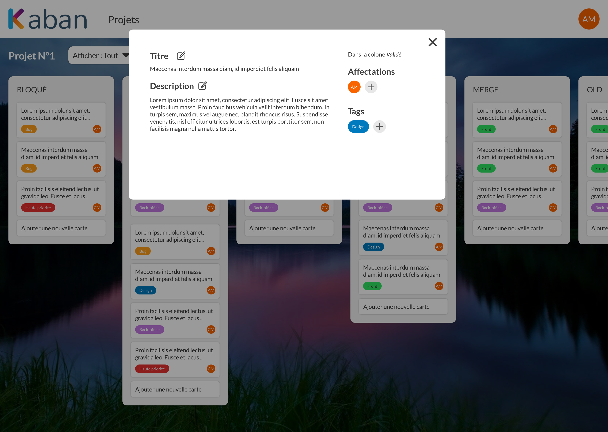

<!-- [![Contributors][contributors-shield]][contributors-url]
[![Forks][forks-shield]][forks-url]
[![Stargazers][stars-shield]][stars-url]
[![Issues][issues-shield]][issues-url]
[![MIT License][license-shield]][license-url]
[![LinkedIn][linkedin-shield]][linkedin-url] -->


<!-- PROJECT LOGO -->
<br />
<p align="center">
  <a href="https://github.com/Aedile-IC/aedile">
    
  </a>

  <!-- <h3 align="center">KanbanIC</h3> -->

  <p align="center">
    Project managenement on the IC
    <!-- <br /> -->
    <!-- <a href="https://github.com/Aedile-IC/aedile"><strong>Explore the docs »</strong></a> -->
    <br />
    <br />
    <!-- <a href="">View Demo</a>
    · -->
    <a href="https://github.com/Aedile-IC/aedile/issues">Report Bug</a>
    ·
    <a href="https://github.com/Aedile-IC/aedile/issues">Request Feature</a>
  </p>
</p>


<!-- TABLE OF CONTENTS -->
<details open="open">
  <summary><h2 style="display: inline-block">Table of Contents</h2></summary>
  <ol>
    <li>
      <a href="#about-the-project">About The Project</a>
      <ul>
        <li><a href="#built-with">Built With</a></li>
      </ul>
    </li>
    <li>
      <a href="#getting-started">Getting Started</a>
      <ul>
        <li><a href="#prerequisites">Prerequisites</a></li>
        <li><a href="#installation">Installation</a></li>
      </ul>
    </li>
    <li><a href="#usage">Usage</a></li>
    <li><a href="#roadmap">Roadmap</a></li>
    <li><a href="#contributing">Contributing</a></li>
    <li><a href="#license">License</a></li>
    <li><a href="#contact">Contact</a></li>
    <li><a href="#acknowledgements">Acknowledgements</a></li>
  </ol>
</details>


<!-- ABOUT THE PROJECT -->
## About The Project

A simple way to manage your daily tasks and projects. Collaborate easily and securily.

‍Aedile is built on the Internet Computer !




### Built With

* [VueJs](https://vuejs.org/)
* [Dfinity](https://dfinity.org/)

<!-- GETTING STARTED -->
## Getting Started

To get a local copy up and running follow these simple steps.

### Prerequisites

This is an example of how to list things you need to use the software and how to install them.
* npm
  ```sh
  npm install npm@latest -g
  ```
* dfinity
  ```sh
  DFX_VERSION=0.7.0-beta.3 sh -ci "$(curl -fsSL https://sdk.dfinity.org/install.sh)" 

  ```


### Installation
1. Install NPM packages
   ```sh
   npm install
   ```
2. Run a Dfinity node locally on a terminal
   ```sh
   dfx start
   ```
3. Deploy you canisters locally
   ```sh
    ./deploy.sh #(mandatory on the first run, it initializes Internet Identity locally)
    ou
    dfx canister create --all
    dfx build
    dfx canister install --all -m reinstall
   ```
4. Initialize data locally
    ```sh
    ./scripts/initData.sh
    ```
5. Devserver with Hot reload for frontend development
    ```sh
    npm run dev
    ```

<!-- USAGE EXAMPLES -->
## Usage

Documentation coming soon...


<!-- ROADMAP -->
## Roadmap

See the [open issues](https://github.com/Aedile-IC/aedile/issues) for a list of proposed features (and known issues).


<!-- CONTRIBUTING -->
## Contributing

Contributions are what make the open source community such an amazing place to be learn, inspire, and create. Any contributions you make are **greatly appreciated**.

1. Fork the Project
2. Create your Feature Branch (`git checkout -b feature/AmazingFeature`)
3. Commit your Changes (`git commit -m 'Add some AmazingFeature'`)
4. Push to the Branch (`git push origin feature/AmazingFeature`)
5. Open a Pull Request


<!-- LICENSE -->
## License

Distributed under the MIT License. See `LICENSE` for more information.


<!-- CONTACT -->
## Contact

Anthony MARQUES - [@AnthonyMQ23](https://twitter.com/AnthonyMQ23) - amarques@esensconsulting.com

Project Link: [https://github.com/Aedile-IC/aedile](https://github.com/Aedile-IC/aedile)


<!-- ACKNOWLEDGEMENTS
## Acknowledgements

* []()
* []()
* []() -->


<!-- MARKDOWN LINKS & IMAGES -->
<!-- https://www.markdownguide.org/basic-syntax/#reference-style-links -->
[contributors-shield]: https://img.shields.io/github/contributors/github_username/repo.svg?style=for-the-badge
[contributors-url]: https://github.com/Aedile-IC/aedile/graphs/contributors
[forks-shield]: https://img.shields.io/github/forks/github_username/repo.svg?style=for-the-badge
[forks-url]: https://github.com/Aedile-IC/aedile/network/members
[stars-shield]: https://img.shields.io/github/stars/github_username/repo.svg?style=for-the-badge
[stars-url]: https://github.com/Aedile-IC/aedile/stargazers
[issues-shield]: https://img.shields.io/github/issues/github_username/repo.svg?style=for-the-badge
[issues-url]: https://github.com/Aedile-IC/aedile/issues
[license-shield]: https://img.shields.io/github/license/github_username/repo.svg?style=for-the-badge
[license-url]: https://github.com/github_username/repo/blob/master/LICENSE.txt
[linkedin-shield]: https://img.shields.io/badge/-LinkedIn-black.svg?style=for-the-badge&logo=linkedin&colorB=555
[linkedin-url]: https://www.linkedin.com/in/anthony-marques-323256a5/